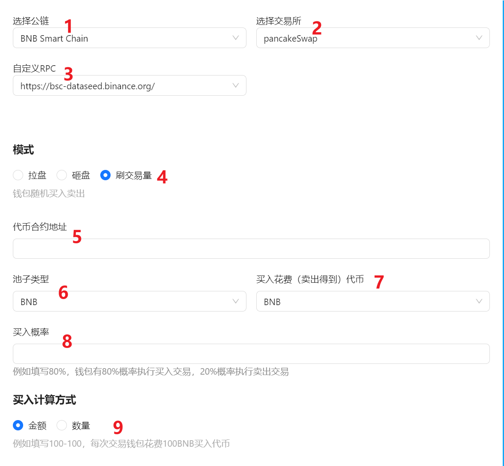
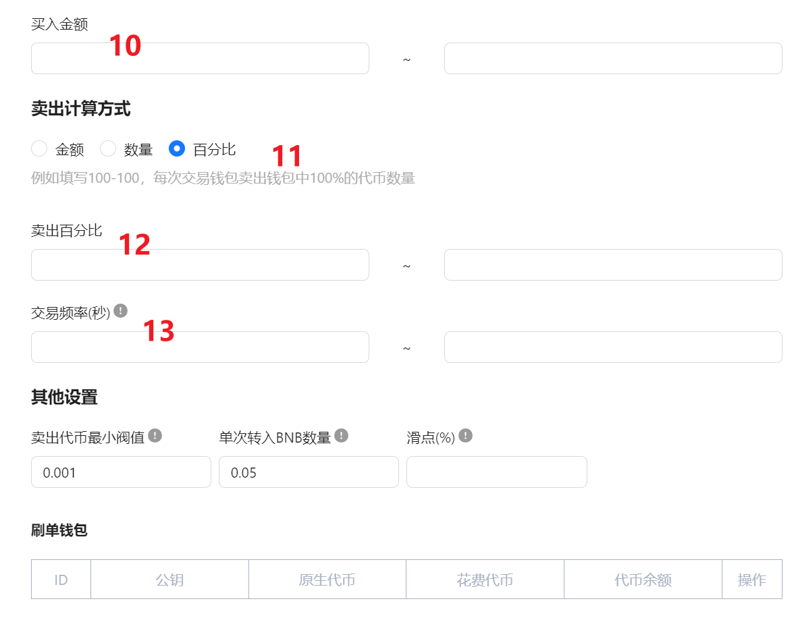
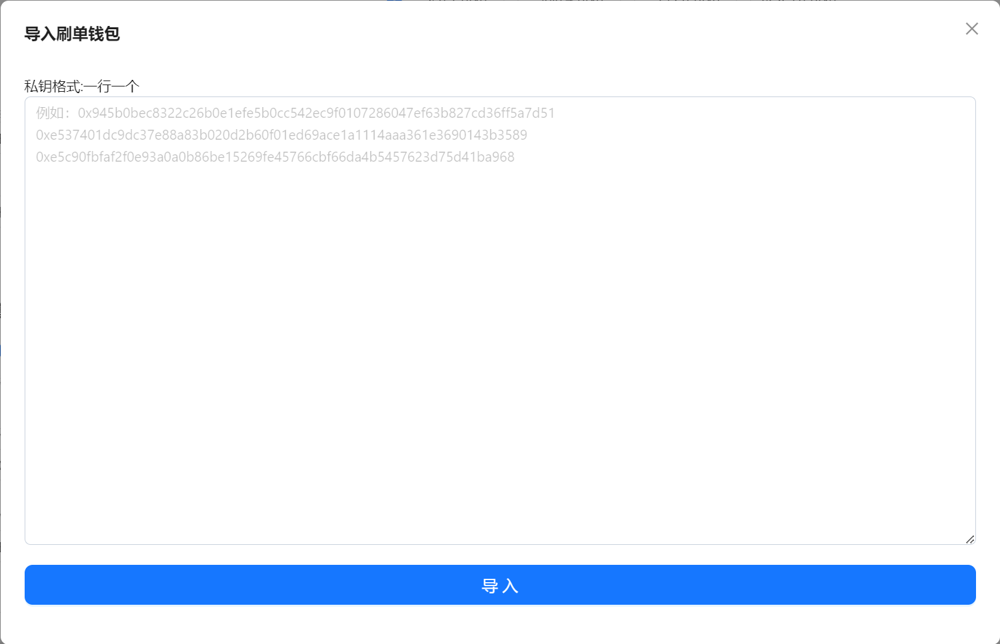
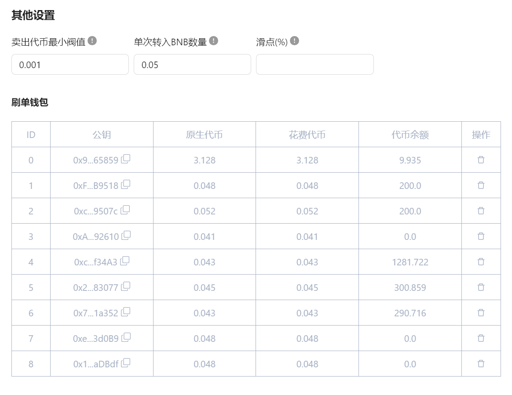

# &#x20;刷交易量模式

## 1、准备阶段

<figure><figcaption></figcaption></figure>

<figure><figcaption></figcaption></figure>

### 1、选择公链 

目前市值管理机器人支持的公链有：（支持BSC、ETH、Arb、Base）

### 2、选择交易所 

基于公链选择的不同，会支持不同的去中心化交易所。BSC链和BSC测试链均支持PancakeSwap V2

### 3、网络节点 

也就是我们通常说的RPC节点。平台会默认给出一个优质节点，如果觉得速度过慢或者有卡顿，也可以自行更换其他节点

### 4、模式 

选择不同模式进行市值管理

* 拉盘：多个钱包多次买入某种代币，稳步提升代币价格
* 砸盘：多个钱包多次卖出某种代币，稳步降低代币价格
* 刷交易量：多个钱包多次买卖代币，增加代币交易量

### 5、合约地址 

输入你要管理市值的代币的合约地址

### 6、池子类型 

指的是你使用何种`交易对`做的池子，例如BSC链，可支持以下几种交易对：

* BNB池子：交易对形式→BNB/代币（或者是：wBNB/代币）
* USDT池子：交易对形式→USDT/代币
* BUSD池子：交易对形式→BUSD/代币

### 7、买入花费（卖出得到）代币 

需选择某种代币作为你的交易货币，可选择BNB、USDT等等。注意，不管使用任何币去交易，钱包里都要有一定数额的BNB充当Gas费

### 8、买入概率 

例如填写80%，钱包有80%概率执行买入交易，20%概率执行卖出交易

### 9、买入计算方法 

钱包在交易时，可按照不同的计算方法进行交易

* **金额：**&#x6BCF;个钱包每次按照一定金额买入代币
* **数量：**&#x6BCF;个钱包每次按照一定数量买入代币

### 10、金额/数量 

如果第9步选择的是金额，这里就直接输入交易金额。（例如第7步选择的`花费代币`是USDT，那么数字1就代表1U。若花费代币是BNB，数字1就代表1个BNB）

如果第9步选择的是数量，这里就直接输入代币数量

### 11、卖出计算方法 

钱包在交易时，可按照不同的计算方法进行交易

* **金额：**&#x6BCF;个钱包每次按照一定金额卖出代币
* **数量：**&#x6BCF;个钱包每次按照一定数量卖出代币
* **百分比：**&#x6BCF;个钱包每次按照一定百分比卖出代币

### 12、金额/数量/百分比 

如果第9步选择的是金额，这里就直接输入交易金额。（例如第7步选择的`买入花费（卖出得到）代币`是USDT，那么数字1就代表1U。若花费代币是BNB，数字1就代表1个BNB）

如果第9步选择的是数量，这里就直接输入代币数量

如果第9步选择的是百分比，这里就直接输入钱包代币余额的百分比

### 13、时间间隔 

每一笔交易完成后, 都会在随机等待一定时间后, 继续进行下一笔交易，时间单位是秒

## 2、实操阶段 

在填写完成之后，可以看到代币的资金池地址和价格，接下来开始实操：

<figure><figcaption></figcaption></figure>

### 1、首先导入刷单钱包 

输入钱包私钥，一行一个

点击导入按钮，可在左下方看到钱包中代币信息

<figure><figcaption></figcaption></figure>

<figure><figcaption></figcaption></figure>

### 2、点击开始交易按钮 

开始交易，下方日志可看见交易的信息。
