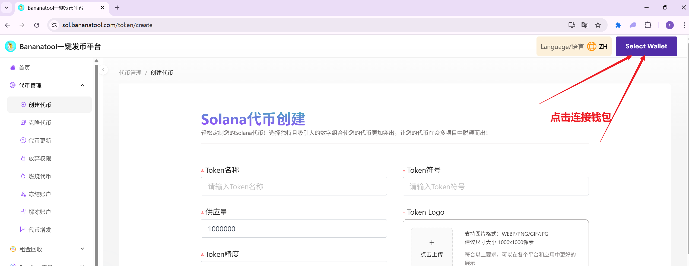

# Solana代币创建教程

## **前提条件** 

* 发币之前，务必使用安装好钱包插件，欧意web钱包、TP钱包、幻影钱包等都可以
* 钱包内最少准备0.2个Sol
* 请打开翻墙软件（VPN/加速器），以防止网络错误
* 手机发币也使用欧易web3钱包、TP钱包或Phantom钱包

### **视频教程**



## **Solana发币教程**

## **1、连接钱包**

首先，我们打开发币链接：[https://sol.bananatool.com](https://sol.bananatool.com)点击右上角"选择钱包"

<figure><figcaption>
连接钱包
</figcaption></figure>

之后会跳出钱包选择页面，点击Phantom，即可链接钱包（如果没有Phantom钱包，使用欧易Web3钱包、TP钱包也可以，同样是点击这个Phantom，平台会自动识别并连接OKX Web3或TP钱包）

<figure><figcaption></figcaption></figure>

右上角出现钱包地址，表示你已经完成的钱包链接

<figure><figcaption></figcaption></figure>

## **2、填写参数**

完成钱包链接之后，接下来就是填写代币参数，具体有如下几项：

<figure><figcaption></figcaption></figure>

**必填部分**

* **全称：**&#x652F;持英文、中文以及中英混合，最多15个字符
* **简称：**&#x652F;持英文、中文以及中英混合，最多15个字符
* **精度：**&#x9ED8;认填9，精度与你能填写的最大供应量有关。
* **供应数量：**&#x5F53;精度为9时，供应量最大不能超过100亿。当精度为8时，不能超过1000亿，以此类推
* **logo：**&#x56FE;片小于**100kb**，尺寸建议256x256像素（正方形）

<figure><figcaption></figcaption></figure>

**选填部分**

* **简介：**&#x4E0D;能超过200个汉字（或200个英文字母）
* **官网链接：**&#x4F1A;出现在Solana浏览器上，如：[https://www.bananatool.com/](https://www.bananatool.com/)
* **Telegram群组：**&#x4F1A;出现在Solana浏览器上，如：[https://t.me/BananaTools](https://t.me/BananaTools)
* **Twitter链接：**&#x4F1A;出现在Solana浏览器上，如：[https://x.com/Banana\_Tool](https://x.com/Banana_Tool)
* **Discord链接：**&#x4F1A;出现在Solana浏览器上，如：https://discord.orca.so/

**关于代币精度**：代币精度定义了代币可以分割到多小的单位。 SPL代币的最大精度是9，常见的精度设置是6（实用代币）和9（高精度应用），0精度通常用于NFT。可参考以下数值设置

<figure><figcaption></figcaption></figure>

## **3、代币权限设置**

* **元数据更改权：**“放弃所有权”意味着您将无法修改令牌元数据。
* **冻结权：**&#x5982;果您放弃冻结权限，则意味着您将无法冻结持有者钱包中的代币。
* **铸币权：**“放弃铸币权”对于让投资者感到更加安全和作为代币的成功是必要的。如果您放弃铸币权，则意味着您将无法铸造更多代币供应。

<figure><figcaption></figcaption></figure>

## **4、创建代币**

确定好信息无误之后，点击“创建代币”按钮，这时候会跳出钱包，确认并支付费用即可，如下所示：

<figure><figcaption></figcaption></figure>

等待几秒钟之后，创建成功后网页下方可以看到代币地址，或者在浏览器和钱包中查看新创建的代币信息。（注意：代币是否创建成功以扣费为准，只要扣费了就肯定成功，只要没成功就肯定没扣费）

<figure><figcaption></figcaption></figure>

## **常见问题：** 

**1、Solana上发币需要合约开源吗？**

* 答：不需要，Solana上的代币是通过官方发布好的合约创建出来的账户，所有的SPL20代币都用的是同一的合约。

**2、Sol发币需要多少钱？**

* &#x7B54;**：**&#x53D1;币费用是0.1sol，如果再加上一些gas费，估计0.15sol左右

**3、为什么钱包不显示 logo？**

* 答：Phantom钱包有时候信息有延迟，需要耐心等待一段时间。可以在Solana浏览器上搜索代币信息进行查看。

**4、手机应该怎么发币？**

* &#x7B54;**：**&#x624B;机可以使用欧易web3钱包或者Phantom钱包app进行操作

**5、什么情况下丢弃权限？**

* 答：一般情况下，在需要在 Raydium 添加的代币需要放弃冻结和铸币权限，元数据修改权限可以自行选择，如果放弃元数据权限，那么代币名称和logo将不能更新。

**6、其他问题**

* 任何问题，都可以进入Telegram电报群找志愿者解答： [https://t.me/BananaTools](https://t.me/BananaTools)
