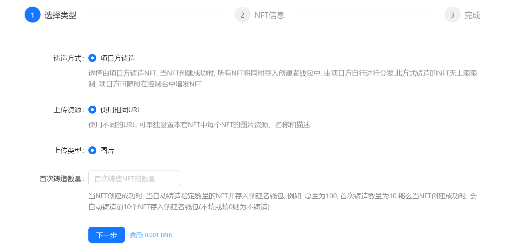
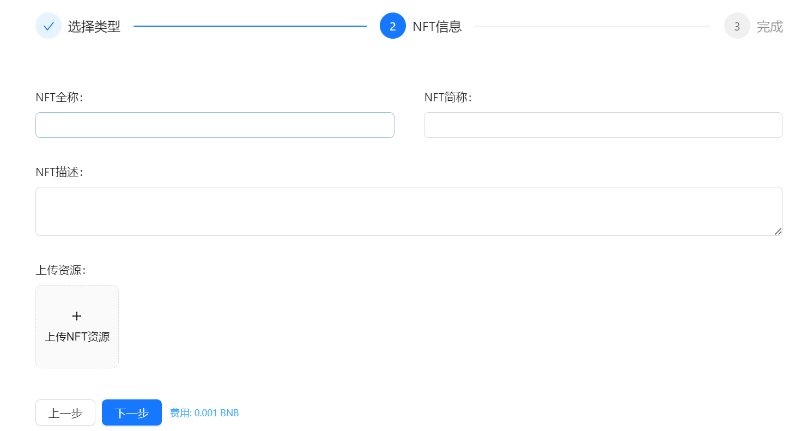
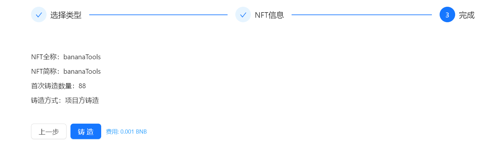

# 创建NFT

创建NFT视频教程



## BananaTool 系列NFT创建  

BananaTools支持BSC、ETH、OKX等多条公链的NFT创建, 灵活支持多种创建方式. 可在几分钟内将您的作品生成为NFT.


NFT代表非同质化代币（Non-Fungible Token），是一种数字资产标准，用于在区块链上表示和交易独一无二的数字资产或物品。

**BananaTool创建的NFT均为系列NFT**, 每套NFT中均可包含多个单独的NFT, 每个NFT都有其在系列中的唯一序号


## 1. 选择NFT类型  

进入NFT创建页面: [https://bananatool.com/nft/create](https://bananatool.com/nft/create)

填写首次铸造数量

<figure><figcaption></figcaption></figure>

## 2. 填写NFT信息 

<figure><figcaption></figcaption></figure>

* **全称**: 本套NFT的全称
* **简称**: 本套NFT的简称
* **描述**: NFT对应的描述文案

## 3. 创建NFT 

<figure><figcaption></figcaption></figure>

检查信息无误后， 点击下方【铸造】按钮即可。

等待交易完成后，您的NFT即成功创建
