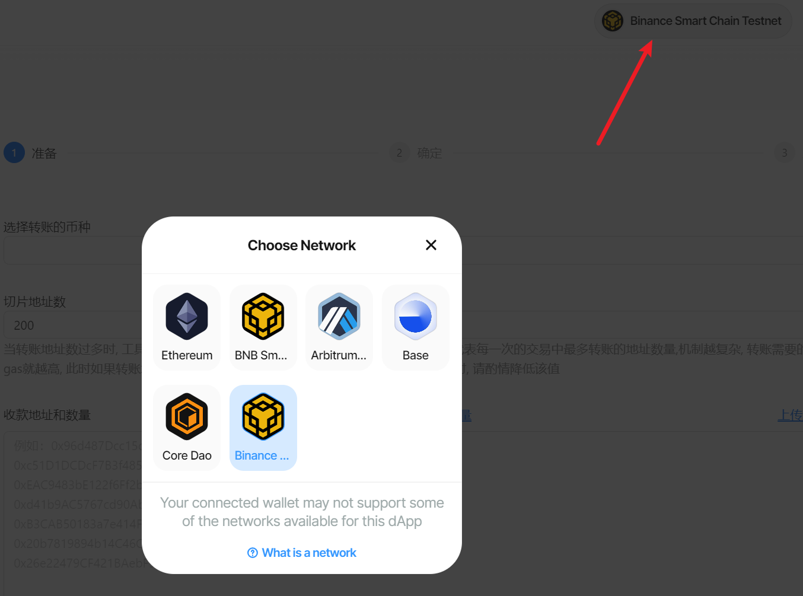

# 批量归集(多转一)教程

批量归集视频教程：




批量归集 | 多账户资金回收 | 高效资金管理

方便快捷地将分散在多个账户中的代币统一归集到一个主账户，提高资金管理的效率，同时减少交易成本和时间。


## 工具使用说明 

## 1、连接钱包 

* 使用浏览器或者钱包打开网址：[https://bananatool.com/multisend](https://bananatool.com/multisend)，点击右上角，将钱包切换到您所需要的网络，即可在哪个钱包转账。这里以币安测试网为例（BSC Testnet）
*

    <figure><figcaption></figcaption></figure>

## 2、导入钱包 

<figure><figcaption></figcaption></figure>

在弹出框中输入钱包私钥，一行一个

<figure><figcaption></figcaption></figure>

## 3、归集代币 

<figure><figcaption></figcaption></figure>

* **选择公链** : 归集的代币属于那条公链
* **选择代币** : 从代币列表中，选择要归集的代币。如果列表没有你要选择的代币，选择其他代币输入代币合约地址
* **发送数量** : 默认归集钱包中全部代币余额
* **接收地址** : 归集代币的接收钱包地址

确认归集信息无误之后，点击执行，即可完成批量归集，所有转账信息都可以在链上查询
