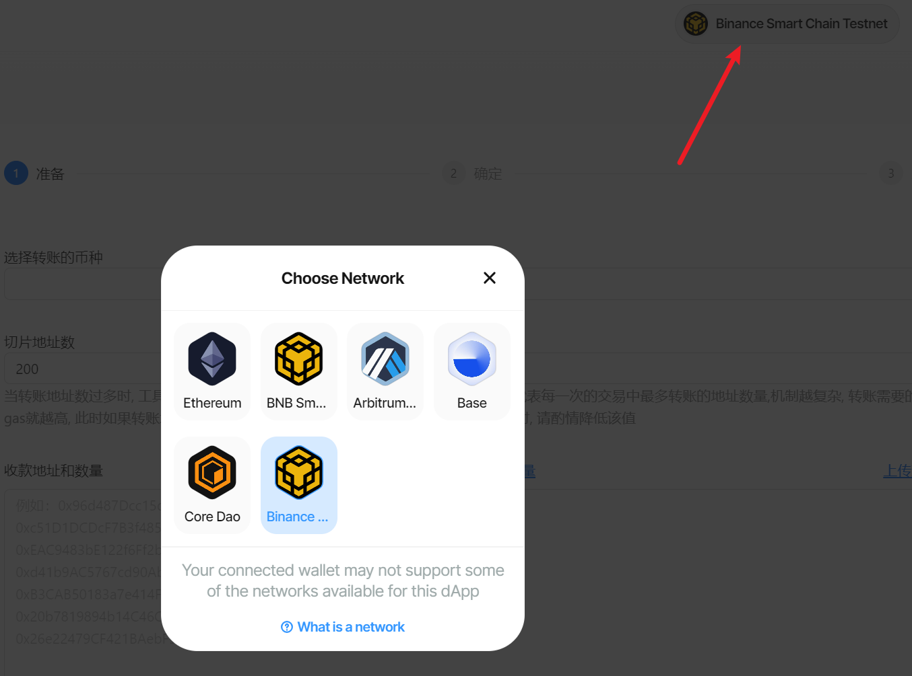
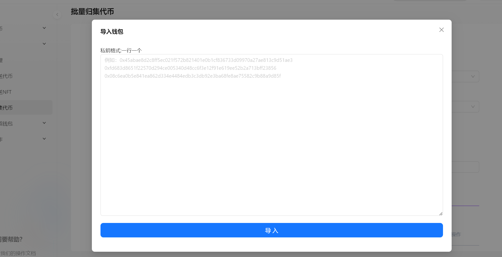

# 批量转账(多转多)教程


批量处理多个钱包资金定向转移，提升资金管理效率


## 工具使用说明 

## 1、连接钱包 

* 使用浏览器或者钱包打开网址：[https://bananatool.com/multiSender](https://bananatool.com/multiSender)，点击右上角，将钱包切换到您所需要的网络，即可在哪个钱包转账。这里以币安测试网为例（BSC Testnet）
*

    <figure><figcaption></figcaption></figure>

## 2、填写参数

<figure><figcaption></figcaption></figure>

* **选择公链** : 归集的代币属于那条公链
* **选择代币** : 从代币列表中，选择要归集的代币。如果列表没有你要选择的代币，选择其他代币输入代币合约地址
* **发送数量** : 默认归集钱包中全部代币余额
* **接收地址** : 归集代币的接收钱包地址

## 3、导入钱包 

<figure><figcaption></figcaption></figure>

在弹出框中输入钱包私钥，一行一个

<figure><figcaption></figcaption></figure>

## 4、导入接收地址 

<figure><figcaption></figcaption></figure>

<figure><figcaption></figcaption></figure>

确认信息无误之后，点击执行，即可执行多对多转账，所有转账信息都可以在链上查询
