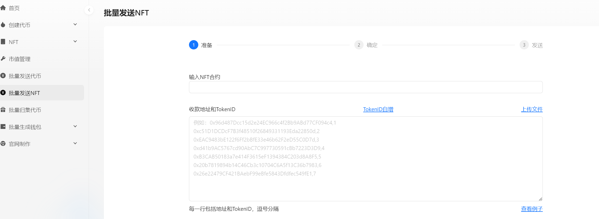
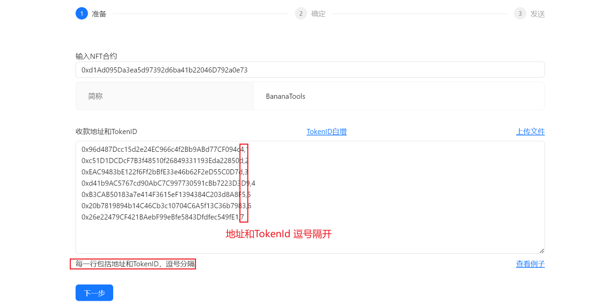
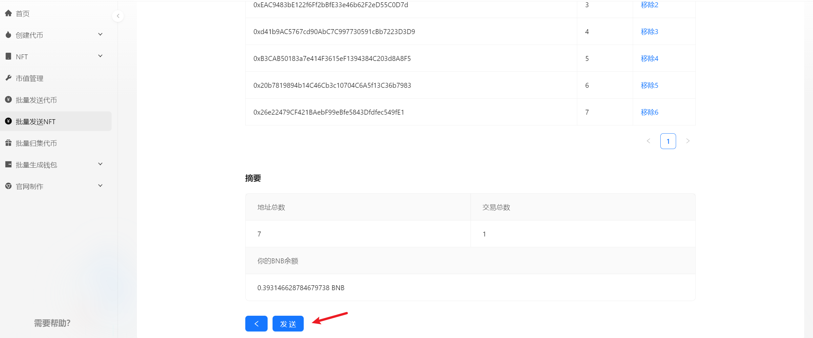

# 批量发送NFT(一转多)教程


批量转账 | 批量空投 | NFT批量发送 | 省钱高效

最好用的空投工具，批量发送NFT，一次交易高效发送到多个钱包，为您安全高效地处理大量转账，转账越多，成本越低！


## 工具使用说明 

## 1、连接钱包 

* 使用浏览器或者钱包打开网址：[https://bananatool.com/multisend](https://bananatool.com/multisend)，点击右上角，将钱包切换到您所需要的网络，即可在哪个钱包转账。这里以币安测试网为例（BSC Testnet）
*

    <figure><figcaption></figcaption></figure>

## 2、输入NFT合约地址 

<figure><figcaption></figcaption></figure>

## 3、输入收款地址与TokenID 

在输入框内，填写转账的目标地址，以及每个目标地址接受的TokenID。地址和TokenID以英文逗号隔开，每行一组，为保证转账效果，一次最好不要输入超过**100个地址**

<figure><figcaption></figcaption></figure>

## 4、发起转账 

确认转账信息无误之后，点击发送，即可完成批量转账，所有转账信息都可以在链上查询

<figure><figcaption></figcaption></figure>

## 工具注意事项 

1.、收款地址和数量必须用英文逗号分隔

2、推荐使用PC端操作，更加方便快捷

3、如往交易所地址进行转账，请务必确认交易所是否支持合约转账，否则你的转账将无法到账

4、为保证转账顺利，一次转账的地址数请勿超过100个

5、支持大部分EVM公链，切换到哪个钱包，就自动在哪个链上转账
